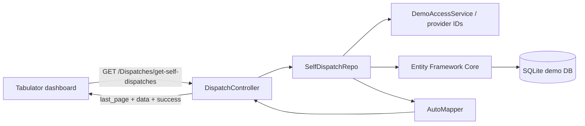
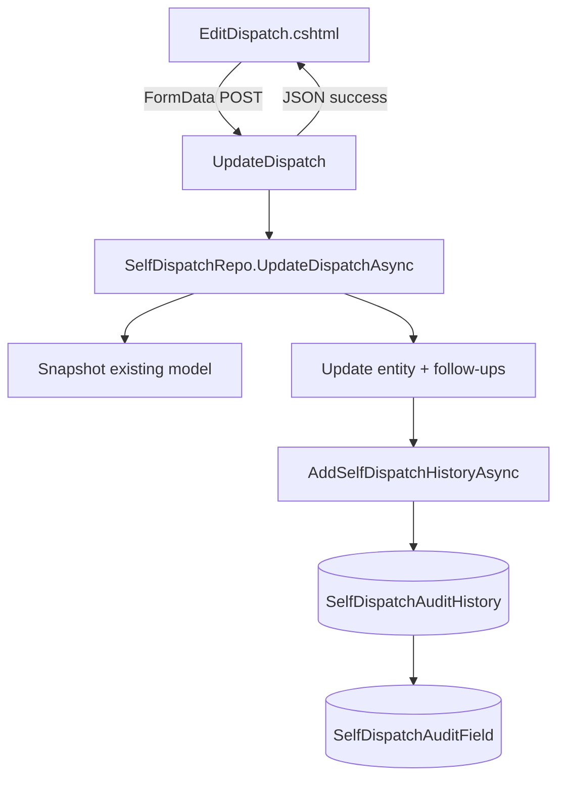
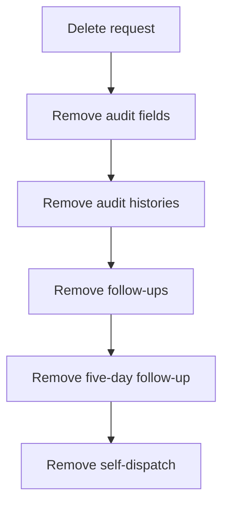

# Architecture

## Dashboard request flow

## Update and audit flow

## Delete flow

## Reconstruction boundaries

The public version intentionally does **not** reproduce internal authentication, company databases, proprietary libraries, organization names, production routes beyond the recovered public-facing MVC route shape, or any operational/clinical records. Demo identities and records are fictional.
